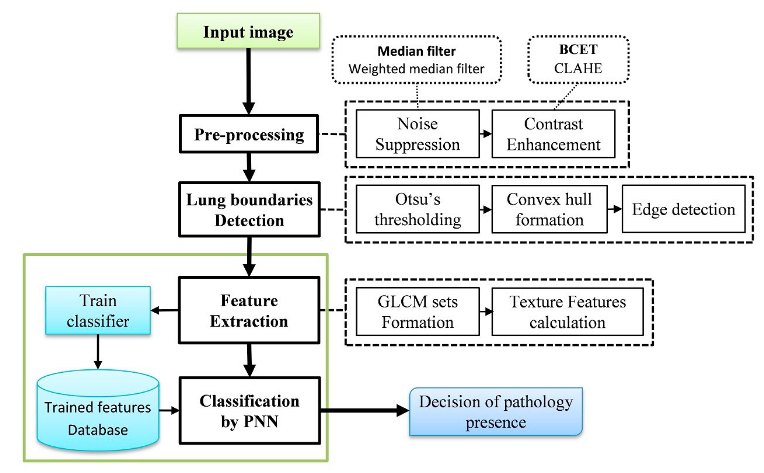

# LungSegmentation
This repository attempts to perform lung segmentation on chest x-ray images using purely image preprocessing and deep learning approaches like U-Net. The segmentation of lung regions can be later used to perform abnomaly detection on chest x-ray regions

# Lung segmentation with image preprocessing approach.
This repository makes use of the preprocessing pipeline suggested by the "Lung boundary detection for chest X-ray images classification based on GLCM and probabilistic neural networks" paper ([Link](https://www.sciencedirect.com/science/article/pii/S1877050919315145) ).

## Preprocessing pipeline


 - The testing script can be ran using the test.py file:
```
	python3 test.py --input <path_to_chest_xray_img_file>
```

## Experimental results
#### 1. Segmentation result using BCET preprocessing


#### 2. Segmentation result using CLAHE on gray scale image


#### 3. Segmentation result using CLAHE on l-channel of LAB image
