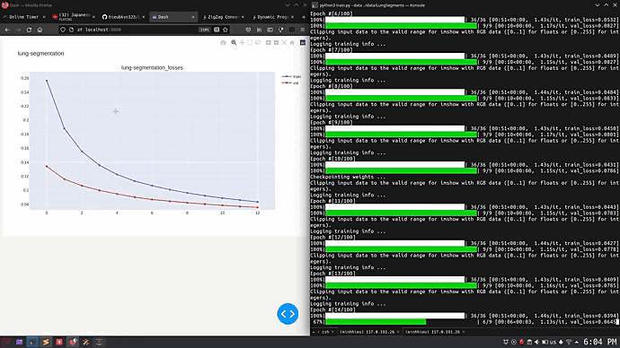

# LungSegmentation
This repository attempts to perform lung segmentation on chest x-ray images using purely image preprocessing and deep learning approaches like U-Net. The segmentation of lung regions can be later used to perform abnomaly detection on chest x-ray regions

# I. Lung segmentation with image preprocessing approach.
This repository makes use of the preprocessing pipeline suggested by the "Lung boundary detection for chest X-ray images classification based on GLCM and probabilistic neural networks" paper ([Link](https://www.sciencedirect.com/science/article/pii/S1877050919315145) ).

### 1. Preprocessing pipeline


 - The testing script can be ran using the test.py file:
```
	python3 test.py --input <path_to_chest_xray_img_file>
```

### 2. Experimental results
#### 2.1. Segmentation result using BCET preprocessing


#### 2.2. Segmentation result using CLAHE on gray scale image


#### 2.3. Segmentation result using CLAHE on l-channel of LAB image


# II. Lung segmentation with deep learning approache.
### 1. Dataset
The dataset to train U-net in this repository is taken from this [github](https://github.com/IlliaOvcharenko/lung-segmentation) repository.

### 2. U-net training
To initiate training of U-Net for segmentation, go into unet directory and run train.py in the following way :
```console
python3 train.py --data <data_dir>
		--epochs <number_training_iter>
		--batch_size <batch_size>
		--val-ratio <ratio_of_validation_set>
		--lr <learning_rate>
		--save-path <checkpoint_dir>
		--log-dir <log_dir>
```

Where :
   * "data_dir" is the data directory containing two sub-directories "images" and "masks". 
   * "save_path" is the checkpoint directory in which two files will be produced :
       * model.weights.hdf5 : model weights file.
       * model.h5 : model structure
   * "log_dir" is the directory at which training info is store"

After successful run of the training script, the terminal should appear as followed :


### 3. Training info dash board
To view training info (losses, accuracies) in real time. Run :

```console
python3 dashboard --log-dir <log_dir>/lung-segmentation
```

The dashboard will be updated every epoch :


### 3. U-net testing
To test the trained model, import the UnetSegmenter class from unet module. The constructor takes in two parameters : the weights file and the model file of the Unet model:
```python
import cv2
from unet import UnetSegmenter

segmenter = UnetSegmenter('checkpoints/model.h5', 'checkpoints/model.weights.hdf5')

img = cv2.imread('images/test1.png')
img = cv2.resize(img, (256, 256))
segmenter.visualize_prediction(img)
```

Sample testing result:

